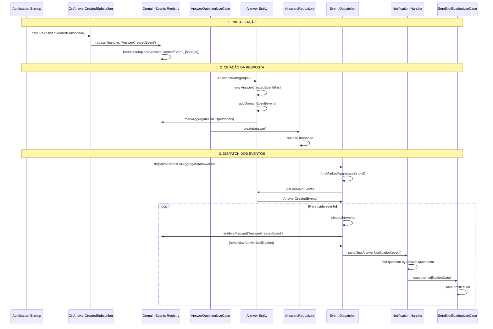
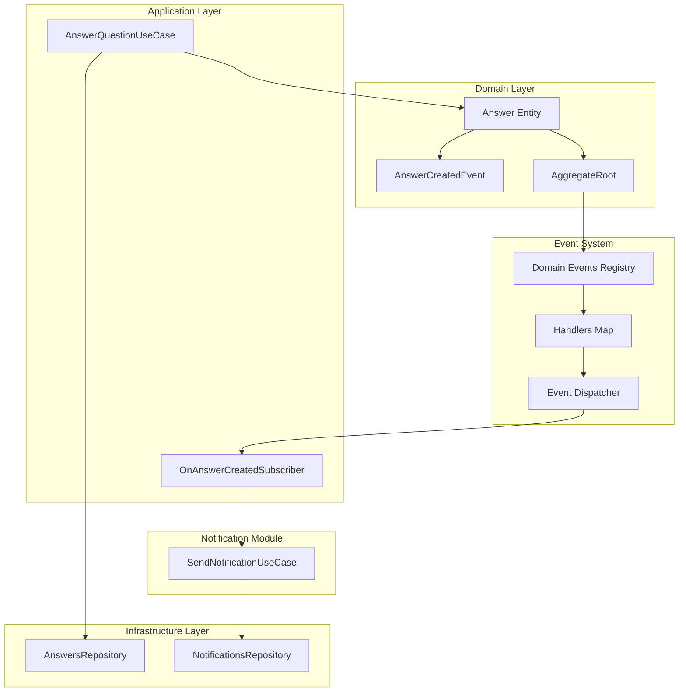
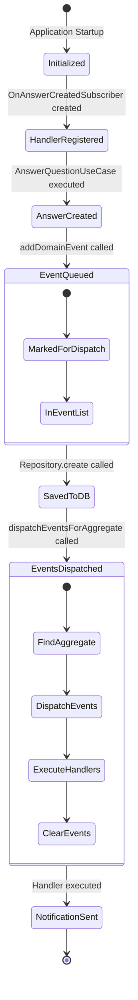
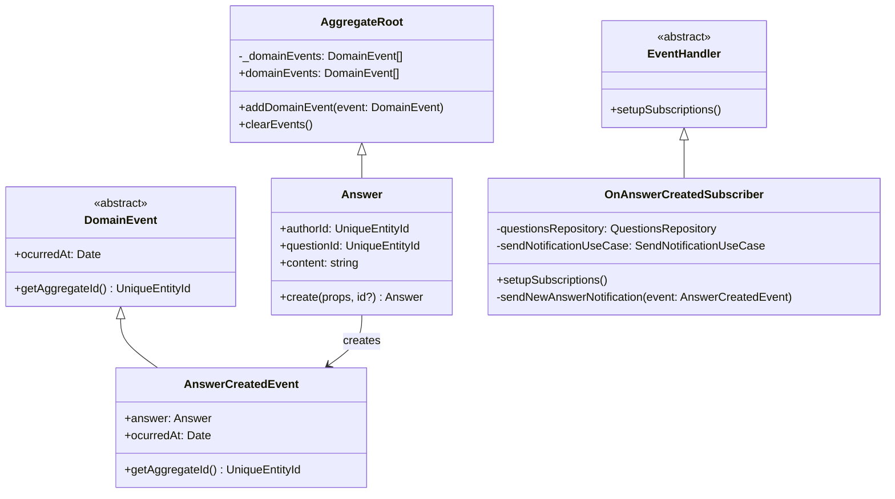

# Diagrama do Fluxo de Eventos de Domínio

## Sequência de Eventos



## Arquitetura do Sistema



## Estados do Sistema



## Estrutura de Dados



## Fluxo de Execução Detalhado

### 1. **Setup (Inicialização)**

```typescript
// handlersMap = new Map()
// markedAggregates = []

new OnAnswerCreatedSubscriber(questionsRepo, sendNotificationUseCase);
// → handlersMap.set('AnswerCreatedEvent', [sendNewAnswerNotification])
```

### 2. **Criação da Resposta**

```typescript
const answer = Answer.create({...});
// → new AnswerCreatedEvent(answer)
// → answer.addDomainEvent(event)
// → markedAggregates.push(answer)

await answersRepository.create(answer);
// → save to database
```

### 3. **Dispatch dos Eventos**

```typescript
dispatchEventsForAggregate(answer.id);
// → findMarkedAggregateById(answer.id)
// → aggregate.domainEvents.forEach(dispatch)
// → handlersMap.get('AnswerCreatedEvent').forEach(handler => handler(event))
// → aggregate.clearEvents()
// → removeAggregateFromMarkedDispatchList(aggregate)
```

### 4. **Processamento da Notificação**

```typescript
sendNewAnswerNotification({ answer });
// → find question by answer.questionId
// → sendNotificationUseCase.execute({
//     recipientId: question.authorId,
//     title: `Nova resposta em "${question.title}..."`,
//     content: answer.excerpt
//   })
```

## Pontos de Atenção

1. **Timing**: O dispatch deve acontecer após o commit da transação
2. **Idempotência**: Handlers devem ser idempotentes (poderem ser executados múltiplas vezes sem efeitos colaterais)
3. **Falhas**: Se um handler falhar, outros handlers ainda devem ser executados
4. **Performance**: Múltiplos handlers para o mesmo evento são executados sequencialmente
5. **Limpeza**: Eventos são limpos após o dispatch para evitar reprocessamento
