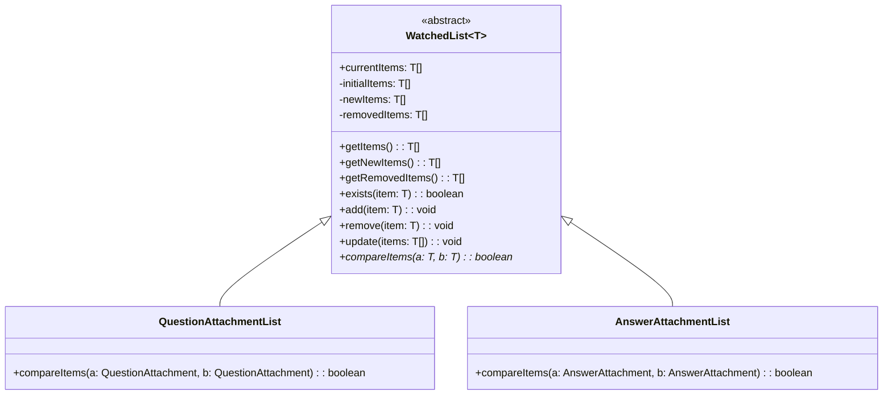
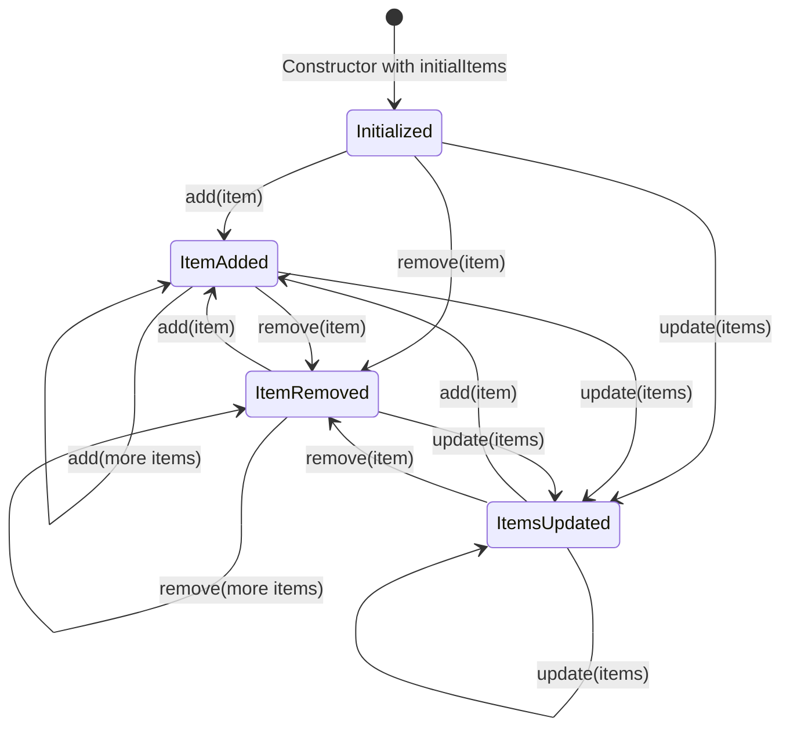
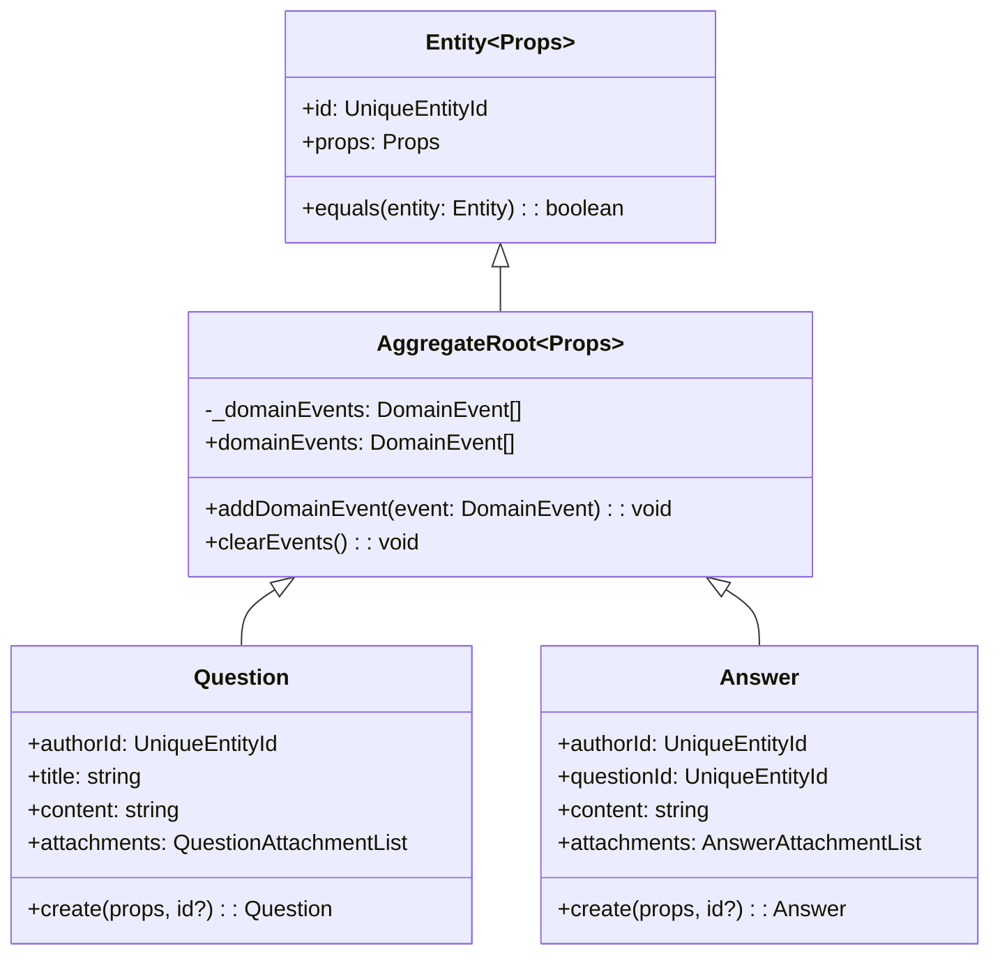
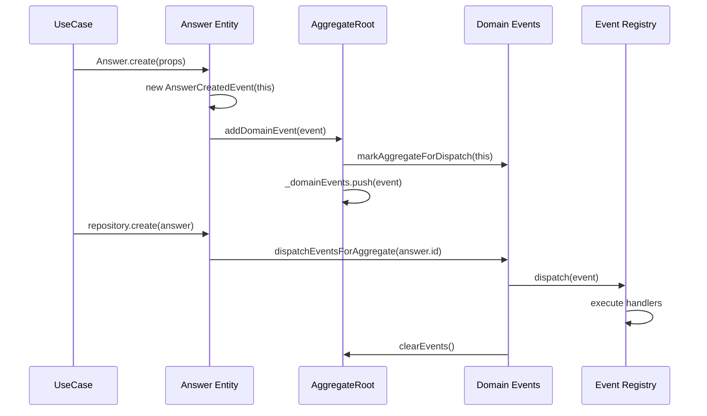
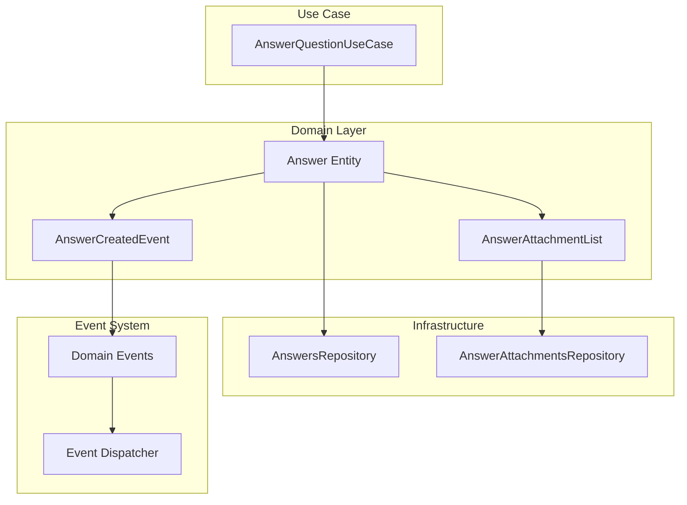

# WatchedList e Aggregate: Sistema de Rastreamento de Mudanças

## Visão Geral

Este documento explica como o sistema de `WatchedList` e `AggregateRoot` funciona no projeto Clean DDD, permitindo o rastreamento eficiente de mudanças em coleções e a gestão de eventos de domínio.

## WatchedList: Rastreamento Inteligente de Coleções

### Conceito

A `WatchedList` é uma classe abstrata que rastreia mudanças em coleções de objetos, mantendo controle sobre:

- **Itens atuais**: Lista completa dos itens no momento
- **Itens iniciais**: Estado original da lista
- **Novos itens**: Itens adicionados desde a criação
- **Itens removidos**: Itens removidos desde a criação

### Arquitetura



### Estados da WatchedList



### Implementação Detalhada

#### 1. **Estrutura de Dados**

```typescript
export abstract class WatchedList<T> {
  public currentItems: T[];        // Lista atual
  private initialItems: T[];       // Estado inicial
  private newItems: T[];          // Itens adicionados
  private removedItems: T[];      // Itens removidos
}
```

#### 2. **Método de Comparação**

Cada implementação deve definir como comparar itens:

```typescript
// QuestionAttachmentList
export class QuestionAttachmentList extends WatchedList<QuestionAttachment> {
  compareItems(a: QuestionAttachment, b: QuestionAttachment): boolean {
    return a.attachmentId.equals(b.attachmentId);
  }
}

// AnswerAttachmentList
export class AnswerAttachmentList extends WatchedList<AnswerAttachment> {
  compareItems(a: AnswerAttachment, b: AnswerAttachment): boolean {
    return a.attachmentId.equals(b.attachmentId);
  }
}
```

#### 3. **Operações Principais**

```typescript
// Adicionar item
public add(item: T): void {
  if (this.isRemovedItem(item)) {
    this.removeFromRemoved(item);  // Reativa item removido
  }

  if (!this.isNewItem(item) && !this.isInitialItem(item)) {
    this.newItems.push(item);      // Marca como novo
  }

  if (!this.isCurrentItem(item)) {
    this.currentItems.push(item);  // Adiciona à lista atual
  }
}

// Remover item
public remove(item: T): void {
  this.removeFromCurrent(item);

  if (this.isNewItem(item)) {
    this.removeFromNew(item);      // Remove de novos (não existia antes)
    return;
  }

  if (!this.isRemovedItem(item)) {
    this.removedItems.push(item);  // Marca como removido
  }
}
```

### Casos de Uso

#### 1. **Adicionar Anexo a uma Pergunta**

```typescript
const question = makeQuestion();
const attachment = makeQuestionAttachment();

// Adiciona o anexo
question.attachments.add(attachment);

// Verifica mudanças
console.log(question.attachments.getNewItems());     // [attachment]
console.log(question.attachments.getRemovedItems()); // []
```

#### 2. **Remover Anexo de uma Resposta**

```typescript
const answer = makeAnswer();
const attachment = makeAnswerAttachment();
answer.attachments.add(attachment);

// Remove o anexo
answer.attachments.remove(attachment);

// Verifica mudanças
console.log(answer.attachments.getNewItems());     // []
console.log(answer.attachments.getRemovedItems()); // [attachment]
```

#### 3. **Reativar Item Removido**

```typescript
const question = makeQuestion();
const attachment = makeQuestionAttachment();
question.attachments.add(attachment);
question.attachments.remove(attachment);

// Reativa o anexo
question.attachments.add(attachment);

// Verifica mudanças
console.log(question.attachments.getNewItems());     // []
console.log(question.attachments.getRemovedItems()); // []
```

## AggregateRoot: Gestão de Eventos de Domínio

### Conceito

O `AggregateRoot` é a base para todas as entidades que podem gerar eventos de domínio. Ele gerencia:

- **Lista de eventos**: Eventos pendentes de dispatch
- **Marcação para dispatch**: Sinaliza que o aggregate tem eventos para processar
- **Limpeza de eventos**: Remove eventos após processamento

### Arquitetura



### Fluxo de Eventos



### Implementação Detalhada

#### 1. **Estrutura Base**

```typescript
export abstract class AggregateRoot<Props> extends Entity<Props> {
  private _domainEvents: DomainEvent[] = [];

  get domainEvents(): DomainEvent[] {
    return this._domainEvents;
  }

  protected addDomainEvent(domainEvent: DomainEvent): void {
    this._domainEvents.push(domainEvent);
    markAggregateForDispatch(this);
  }

  public clearEvents(): void {
    this._domainEvents = [];
  }
}
```

#### 2. **Criação com Eventos**

```typescript
// Answer Entity
static create(props: Optional<AnswerProps, 'createdAt' | 'attachments'>, id?: UniqueEntityId): Answer {
  const answer = new Answer({
    ...props,
    createdAt: props.createdAt ?? new Date(),
    attachments: props.attachments ?? new AnswerAttachmentList(),
  }, id);

  const isNewAnswer = !id;
  if (isNewAnswer) {
    answer.addDomainEvent(new AnswerCreatedEvent(answer));
  }

  return answer;
}
```

#### 3. **Modificações com WatchedList**

```typescript
// Question Entity
set attachments(values: QuestionAttachmentList) {
  this.props.attachments = values;
  this.touch(); // Atualiza updatedAt
}

// O touch() pode ser usado para gerar eventos se necessário
private touch(): void {
  this.props.updatedAt = new Date();
  // Potencial: this.addDomainEvent(new QuestionUpdatedEvent(this));
}
```

## Integração: WatchedList + AggregateRoot

### Cenário Completo



### Exemplo Prático

```typescript
// 1. Criar resposta com anexos
const answer = Answer.create({
  content: 'Nova resposta',
  authorId: new UniqueEntityId('instructor-1'),
  questionId: new UniqueEntityId('question-1'),
  attachments: new AnswerAttachmentList([
    makeAnswerAttachment(),
    makeAnswerAttachment()
  ])
});

// 2. Modificar anexos
answer.attachments.add(makeAnswerAttachment());
answer.attachments.remove(answer.attachments.getItems()[0]);

// 3. Salvar no repositório
await answersRepository.create(answer);

// 4. Processar anexos baseado nas mudanças
const newAttachments = answer.attachments.getNewItems();
const removedAttachments = answer.attachments.getRemovedItems();

// 5. Salvar anexos novos
for (const attachment of newAttachments) {
  await answerAttachmentsRepository.create(attachment);
}

// 6. Remover anexos deletados
for (const attachment of removedAttachments) {
  await answerAttachmentsRepository.delete(attachment);
}

// 7. Dispatch dos eventos
dispatchEventsForAggregate(answer.id);
// → AnswerCreatedEvent é processado
// → Notificação é enviada
```

## Vantagens do Sistema

### 1. **Eficiência no Banco de Dados**

```typescript
// Sem WatchedList (ineficiente)
const currentAttachments = await repository.findByAnswerId(answerId);
const newAttachments = calculateNewAttachments(currentAttachments, updatedAttachments);
const removedAttachments = calculateRemovedAttachments(currentAttachments, updatedAttachments);

// Com WatchedList (eficiente)
const newAttachments = answer.attachments.getNewItems();
const removedAttachments = answer.attachments.getRemovedItems();
```

### 2. **Consistência de Eventos**

```typescript
// Eventos são gerados automaticamente
answer.addDomainEvent(new AnswerCreatedEvent(answer));

// E despachados no momento correto
dispatchEventsForAggregate(answer.id);
```

### 3. **Rastreabilidade**

```typescript
// Fácil auditoria de mudanças
console.log('Novos anexos:', question.attachments.getNewItems());
console.log('Anexos removidos:', question.attachments.getRemovedItems());
console.log('Total de anexos:', question.attachments.getItems().length);
```

## Padrões de Uso

### 1. **Criação de Nova Entidade**

```typescript
const entity = EntityClass.create(props);
// → Eventos são criados automaticamente
// → Aggregate é marcado para dispatch
```

### 2. **Modificação de Coleção**

```typescript
entity.collection.add(item);
entity.collection.remove(item);
// → Mudanças são rastreadas
// → Repositório pode processar eficientemente
```

### 3. **Persistência**

```typescript
await repository.create(entity);
// → Entidade é salva
// → Eventos são despachados
// → Coleções são processadas baseado nas mudanças
```

### 4. **Testes**

```typescript
// Teste de eventos
expect(entity.domainEvents).toHaveLength(1);
expect(entity.domainEvents[0]).toBeInstanceOf(ExpectedEvent);

// Teste de mudanças em coleção
expect(entity.collection.getNewItems()).toHaveLength(1);
expect(entity.collection.getRemovedItems()).toHaveLength(0);
```

## Considerações de Performance

1. **Memória**: WatchedList mantém 4 arrays em memória
2. **Comparação**: Método `compareItems` é chamado frequentemente
3. **Eventos**: Lista de eventos cresce até o dispatch
4. **Limpeza**: Eventos são limpos após dispatch para evitar vazamentos

## Boas Práticas

1. **Implementar `compareItems` eficientemente**
2. **Usar IDs para comparação quando possível**
3. **Limpar eventos após dispatch**
4. **Testar cenários de reativação de itens**
5. **Monitorar crescimento de listas de eventos**

Este sistema permite um controle granular sobre mudanças em entidades complexas, facilitando a persistência eficiente e a geração consistente de eventos de domínio.
