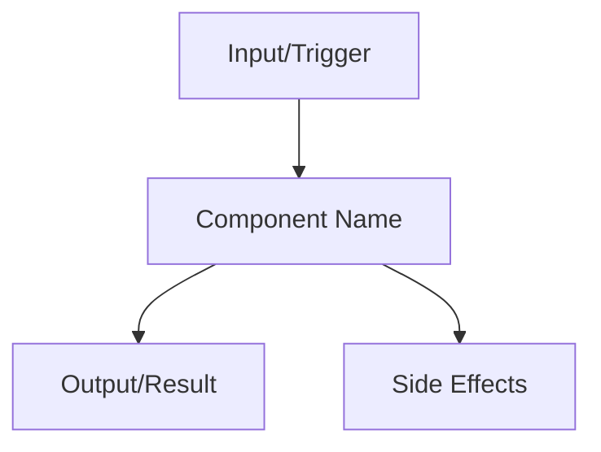

# [Component Name] Documentation

## Overview

[Brief description of what this component is and its purpose in the domain]

## Domain Context

- **Domain**: [Which domain this component belongs to]
- **Bounded Context**: [Specific bounded context if applicable]
- **Ubiquitous Language**: [Key terms and concepts]

## Business Rules

- [Rule 1: Description of the business rule]
- [Rule 2: Description of the business rule]
- [Rule 3: Description of the business rule]

## Relationships

### Dependencies

- [Component A]: [Type of relationship - e.g., "depends on", "uses", "contains"]
- [Component B]: [Type of relationship]

### Dependents

- [Component X]: [Type of relationship - e.g., "uses this", "depends on this"]
- [Component Y]: [Type of relationship]

## Data Flow



## Implementation Details

### File Structure

```
src/domain/[domain]/enterprise/entities/[component-name].entity.ts
src/domain/[domain]/application/repositories/[component-name]s.repository.ts
src/domain/[domain]/application/use-cases/[action]-[component-name].use-case.ts
test/factories/make-[component-name].ts
test/repositories/in-memory-[component-name]s.repository.ts
```

### Key Methods

- `create()`: [Description of creation method]
- `[method-name]()`: [Description of other important methods]

### Validation Rules

- [Validation rule 1]
- [Validation rule 2]

## Usage Examples

### Creating a [Component Name]

```typescript
const [componentName] = [ComponentName].create({
  // required properties
});
```

### Using in a Use Case

```typescript
const result = await create[ComponentName]UseCase.execute({
  // request parameters
});
```

## Testing Considerations

- [Test scenario 1]
- [Test scenario 2]
- [Edge cases to consider]

## Related Components

- [Related component 1]: [Brief description of relationship]
- [Related component 2]: [Brief description of relationship]

## Notes

[Any additional notes, considerations, or future improvements]
